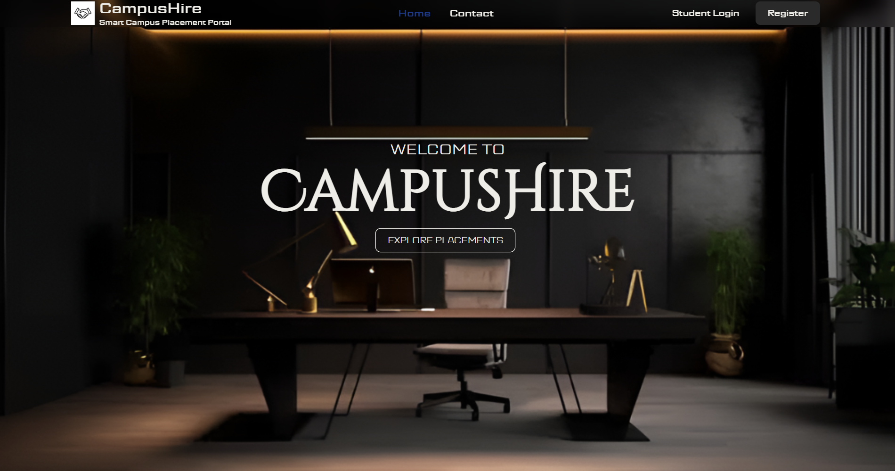
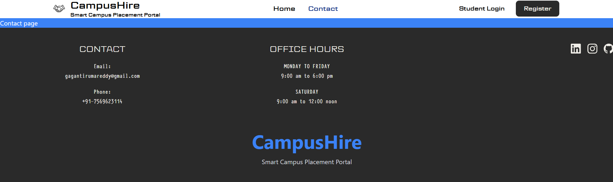
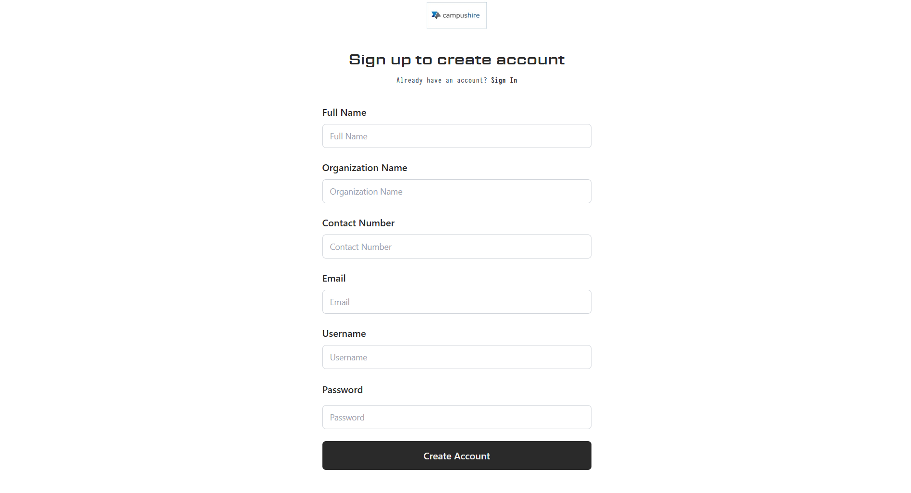

# 🎓 CampusHire – Smart Campus Placement Portal

CampusHire is a full-stack web application designed to simplify and digitize the campus placement process. It connects students, companies, and placement officers through a single platform, enabling efficient placement drive management, job applications, interview scheduling, and recruitment tracking.

---

## 🚀 Features

### 👨‍🎓 Student Portal
- Student Registration & Login
- Profile Management
- Resume Upload
- Browse Placement Drives
- Apply for Placement Opportunities
- Track Application Status
- View Interview Schedule

### 🏢 Company Portal
- Company Registration & Login
- Create Placement Drives
- Manage Job Requirements
- View Student Applications
- Shortlist Candidates
- Schedule Interviews

### 👨‍💼 Placement Officer
- Manage Students
- Manage Companies
- Monitor Placement Drives
- Track Overall Placement Activities

### 🔐 Authentication & Security
- JWT-Based Authentication
- Role-Based Access Control
- Secure Login System

### 📄 Document Management
- Resume Upload
- PDF Generation
- PDF Preview Support

### 📧 Notifications
- Email Notifications
- Interview Notifications
- Application Status Updates

---

# 🛠 Tech Stack

## Backend
- Java 17
- Spring Boot
- Spring Security
- Spring Data JPA (Hibernate)
- REST APIs

## Frontend
- React.js
- Tailwind CSS
- Axios

## Database
- PostgreSQL

## Build Tools
- Maven
- Vite

---

# 📂 Project Structure

```
CampusHire
│
├── backend
│   ├── controller
│   ├── entity
│   ├── repository
│   ├── service
│   └── config
│
├── frontend
│   ├── components
│   ├── assets
│   ├── pages
│   └── utils
│
└── README.md
```

---

# ⚙ Installation

## Clone Repository

```bash
git clone https://github.com/gagantirumareddy/CampusHire.git
```

```
cd CampusHire
```

---

## Backend

```bash
cd backend
```

Run

```bash
mvn spring-boot:run
```

---

## Frontend

```bash
cd frontend
npm install
npm run dev
```

Open

```
http://localhost:5173
```

---

# 🎯 Modules

- Student Management
- Company Management
- Placement Drives
- Application Management
- Interview Scheduling
- Profile Management
- Authentication
- Admin Dashboard

---

# 💡 Future Enhancements

- AI Resume Analysis
- Resume Score Prediction
- Company Recommendation System
- Placement Analytics Dashboard
- Email & SMS Notifications
- Real-Time Chat
- College ERP Integration

---

# 📸 Screenshots

### 🏠 Home Page



### 👨‍🎓 Login page


### 🏢 Contact Page



### 👨‍💼 Register Forum




---

# 👨‍💻 Developed By

**Tirumareddy Gagan**

B.Tech – Electronics & Communication Engineering

---

## ⭐ If you found this project useful, don't forget to give it a Star.